# HandRexS: easy scene switcher system for VRC

VRChatのExpressionsMenuからOBSのシーン切り替えをすることが出来るようになります。

配信しながらOBSのシーン切り替えをするのって面倒だよね～。なので作りました。

旧ツール([HandRex:easy recorder system for VRC](https://kurogane-gk.booth.pm/items/4370494))から、配信機能が追加されました。

旧ツール側との需要が全く違うので、別ツールとして公開します。

※ 基本的にシーン切り替えのみを使用する場合、大きな事故が起きる危険性は少ないと思われますが、念のため、何かのデスクトップを見るツールでちゃんと動いているか見ておいてください。

問題報告、ご意見、改善案、新機能提案などがあればぜひ↓のフィードバックフォームまで！！！

https://docs.google.com/forms/d/e/1FAIpQLSeqNhhHpFh9A41OamSO6i-hh1BGTvr6kr5p8icIh5Dm74SUWg/viewform?usp=sf_link

## 概要

VRCのOSC出力を監視して、特定の変数(bool)がONになったら、シーン切り替え、及び録画開始の信号をobsに送信します。

[obs-websocket](https://github.com/obsproject/obs-websocket)への通信を仲介するツールです。

そのため、アバターに変数を仕込んであげる必要があります。もっと賢い導入方法をご存じの方が居れば教えてください。

## 導入

OBSは各自で設定してください。

現状、v28以降のOBSでのみ動作します(厳密にはobs-wbsocket v5.0に対応したOBSが必須です)。

### 1．OBS上のwebsocketの設定

OBS標準搭載のwebsocketを使用します。

「ツール」→「obs－websocketの設定」の順で押してください。

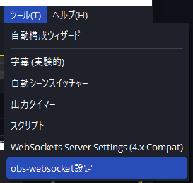

次に「obs－websocket設定」画面の「接続情報を表示」の画面を押してください。

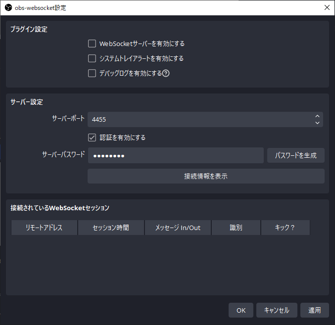

するとIP、ポートとパスが表示されます。これらはあとで使うので覚えておいてください。メモしてもいいです。

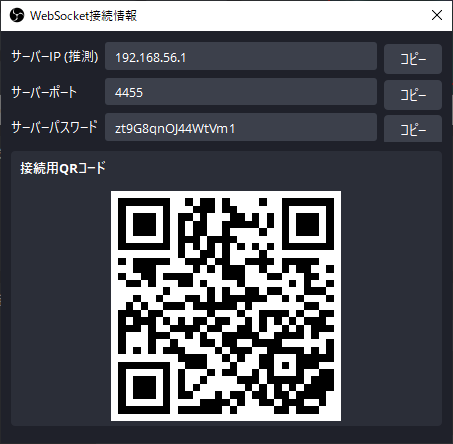

### 3．アバターにboolで各種変数を追加します。

おもむろにunityを起動してください。

VRCExpressionParametersを開いて以下の変数を必要数だけ追加します。追加しない変数があっても動作します。

- recording
  - 録画用
- scene1～9
  - 「scene1」「scene2」と登録してください。
  - シーン登録用。現在、scene9まで登録できるようにしています。

画像のように、「Bool」に設定してください。

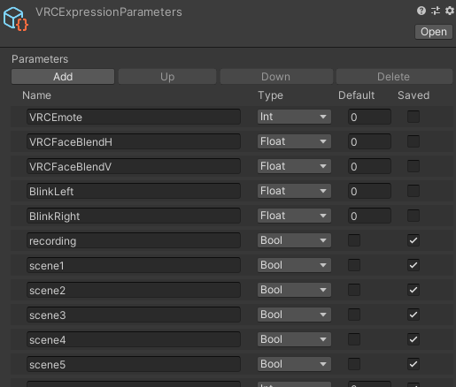

### 4．アバターにメニューを追加します。

VRCExpressionsMenuを開きましょう。

番下の「Add Control」を押して、新しいメニューのNameを「scnene1」(これは好きな名前にしてください)、Typeを「Button」、Parameterを先ほど設定した「scene1」に設定します。

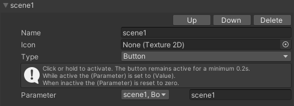

(オプション) 録画ボタンを追加したいときは、「Add Control」を押して、新しいメニューのNameを「Record」、Typeを「Toggle」、Parameterを先ほど設定した「recording」に設定します。

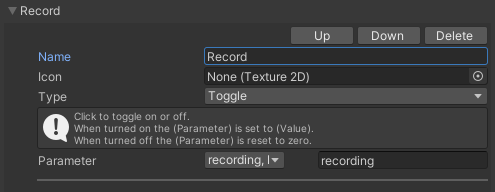

#### 4.5．(オプション) アイコン設定

どうしてもと言うなら、アイコンを設定しても構いません。
その時は同梱のアイコンをunityにD&Dして、spriteに変更してから、

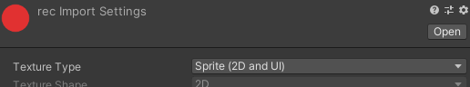

↓のようにアイコンを設定します。

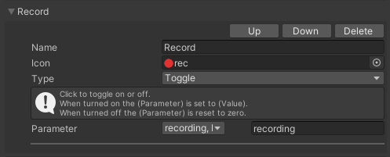

これはしなくても動作自体には問題ありません。

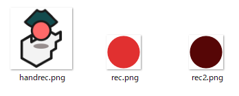

３種類くらいアイコンを入れておきました。必要なら使ってみてください。

### 5．「HandRexS: easy scene switcher system for VRC」の設定&起動

DLした「HandRexS.zip」を解凍します。そういえば解凍って今は通じないことあるんですって。ｺﾜｲﾖｰ

ともかく、この2ファイルがあるはずです。まずは「setting.ini」を開きましょう。

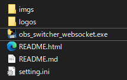

開いたら、先ほどメモした(...してるよね？)IP、portとpassを貼り付けてください。↓みたいな感じです。下の方にある[SCENES]は保存用なので無視して構いません。

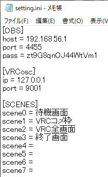

そしたら「obs_switcher_websocket.exe」を起動してください。

注) OBS起動後でないと正常動作しません。ただし、新シーンの作成とシーンの名前変をする必要があります。

別にVRC起動中でも起動前でもどちらでも大丈夫です。VRC起動に特に依存関係はありません。

このようなウィンドウと、黒い画面が出ます。

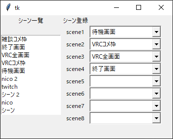

左側にツールが認識したシーン一覧が確認のために出ます。

右側のシーン登録のプルダウンを押すことで、OBS内のシーンを各種変数に登録することが出来ます。

### 6．レッツシーン切り替え

手元のExpressionsMenuを開いたら「scnene1」などのボタンがあるはずです。

ボタンを押すとOBSのシーンが切り替わります(ちゃんと動くといいなぁ)。やったね！！！！

[デモ動画(twitterです！)](https://twitter.com/Kurogane_8_Gk/status/1613567534690889728)

このデモ動画では、

- 待機画面を「scene1」
- 配信画面を「scene2」「scene3」
- 終了画面を「scene4」

に登録しています。

## 動作環境

わからん...。動かなかったら問い合わせてください。

## ライセンス

GPL v3.0です。[aatikturk/obsws-python ](https://github.com/aatikturk/obsws-python) がGPL v3.0だからです。問題があればお問い合わせください。対応できるかはわかりません。

## 寄付は絶賛受付中

絶賛受付中🤑💴です！！！！！！！！！！！！！💴

寄付版を買ってもらうか、以下から投げ銭を受け付けています。

受け付けています！！！！！！！！！！！！！！！

## 問い合わせ先

DM頂戴ね→[Twitter](https://twitter.com/Kurogane_8_Gk)

すぐに答えられるかはわからないけれども。

## 開発者向け

以下は開発者向けです。よしなに。

pythonのコードをpyinstallerでexe化しただけのツールです。厳密には配布しているコードとexeで少しコードが異なりますが、挙動は同じです。コードはコメントを追加して整形しただけです。

##　Requirement

- [python-osc](https://pypi.org/project/python-osc/)
- [obsws-python](https://pypi.org/project/obsws-python/1.4.1/)

後なんか書いておいた方がいい事ってある？
